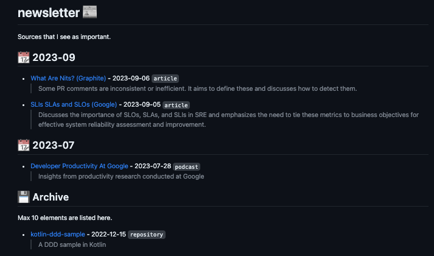

# newsletter

organize and publish a newsletter

[Demo : berkaygiris/newsletter](https://github.com/berkaygiris/newsletter)


## Getting started

### Installation

Not distributed yet, you need to clone the repository.

```shell
go build -o news ; export PATH=$PATH:$(pwd) ; news print
```

Can be used with glow for markdown style

```shell
news print | glow -
```

## Usage

Create an entry and print newsletter
```shell
news add "Design Awesome Tools" "O Reily" "https://www.asd.com/xyz" "cool article but has some inconsistencies" "article" "2023-04-01"

news print
```

```
## 📆 2023-04
- [Design Awesome Tools (O Reily)](https://www.asd.com/xyz) - 2023-04-01 `article`
  > cool article but has some inconsistencies
```

### Commands

```shell
news help
```

```
Usage:
  news [command]

Available Commands:
  add         Add a new entry to the newsletter
  clear       clear data/data.json
  completion  Generate the autocompletion script for the specified shell
  help        Help about any command
  print       Add a new entry to the newsletter
  recover     recover data/saved.json into data/data.json
  save        save asdata/saved.json

Flags:
  -h, --help   help for news

Use "news [command] --help" for more information about a command.
```
